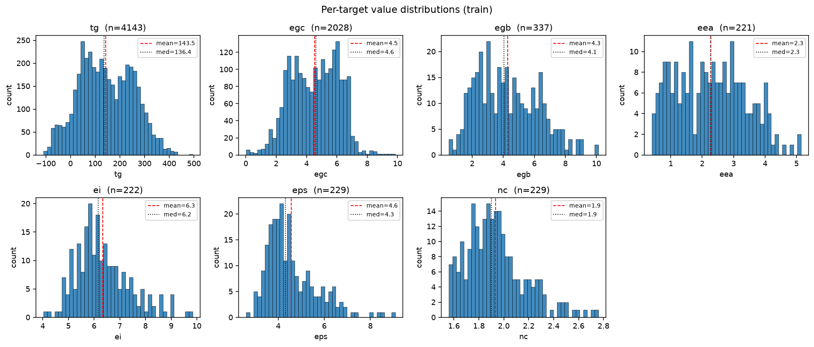
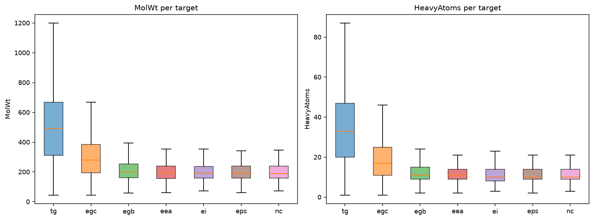
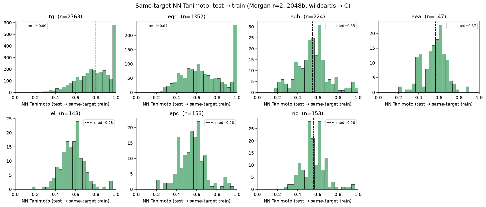

# Deep EDA — Round 2

Extends [06_eda_findings.md](06_eda_findings.md) with chemistry-aware analyses. All results derived from `ppp-round-2/{train,test,PI1M}.csv` using RDKit 2026.03.4 on 2026-08-01.

Scripts under `eda_scripts/deep_eda_*.py`. Figures under `docs/figures/`.

**Section index**
- [S1. Chemistry per target — the polymers are structurally distinct classes](#s1-chemistry-per-target)
- [S2. Canonical-SMILES dedup exposes 2× more cross-set overlap](#s2-canonical-smiles-dedup)
- [S3. Murcko scaffolds — where the OOD test rows live](#s3-scaffold-analysis)
- [S4. Tanimoto NN similarity — 98% of 5-pack test rows have exact-match SMILES in train](#s4-tanimoto-nn-similarity)
- [S5. 5-pack cross-target correlations — huge, exploitable](#s5-cross-target-correlations)
- [S6. Polymer class × target — SMARTS-derived meta-features carry signal](#s6-polymer-class-effects)
- [S7. PI1M vs train — chemically broader, not directly analogous](#s7-pi1m-distribution)
- [S8. Outliers, edge cases, feature health, CV viability](#s8-edge-cases--fold-design)
- [S9. Consolidated implications for modeling](#s9-modeling-implications)

---

## S1. Chemistry per target
Source: `deep_eda_01_chemistry.py`. Full per-target descriptor table + train-vs-test drift check.

Median values per target (train), key columns only:

| target | MolWt | HeavyAtoms | NumRings | NumAromRings | NumRotBonds | MolLogP | TPSA | BackboneAtoms* | HeteroAtoms |
|--------|------:|-----------:|---------:|-------------:|------------:|--------:|-----:|---------------:|------------:|
| eea    | 194.3 | 11 | 1 | 1 | 3 | 2.63 | 17.1 | 9  | 5 |
| ei     | 191.2 | 11 | 1 | 1 | 3 | 2.52 | 18.5 | 9  | 5 |
| eps    | 192.2 | 11 | 1 | 1 | 3 | 2.55 | 18.5 | 9  | 5 |
| nc     | 190.2 | 11 | 1 | 1 | 3 | 2.62 | 17.1 | 9  | 5 |
| egb    | 200.2 | 12 | 1 | 1 | 3 | 2.82 | 23.8 | 9  | 5 |
| egc    | 279.0 | 18 | 1 | 1 | 5 | 3.47 | 49.4 | 12 | 6 |
| **tg** | **491.6** | **32** | **3** | **3** | **8** | **6.10** | **69.7** | **18** | **8** |

*BackboneAtoms = length of the shortest path between the two `*` wildcard atoms.

**Interpretation.**
- The **five 5-pack targets** (eea/ei/eps/nc plus egb, roughly) are **structurally almost indistinguishable at the aggregate level** — all median MolWt ≈ 190–200, 1 ring, 3 rotatable bonds, ~9-atom backbone. This confirms what the row-count overlap already told us: the 5-pack was measured on essentially the same molecule pool.
- **`egc` sits between the 5-pack and `tg`**: bigger molecules (median 279 Da), longer backbones (12 vs 9), and richer heteroatom content. But not as big as `tg`.
- **`tg` molecules are on a completely different scale** — 2.5× the MolWt of the 5-pack, 3× the ring count, 2× the backbone length. Physically these are the large-chain polymers you'd expect: polyimides, polycarbonates, aromatic polyesters, polyphosphazenes.

**Train vs test drift on these axes is negligible** (all columns within a couple percent per target — see script output). No covariate shift on gross chemistry.

---

## S2. Canonical SMILES dedup
Source: `deep_eda_02_scaffolds.py` — canonical-SMILES pass over train+test.

|  | train | test |
|--|------:|-----:|
| unique **raw** SMILES  | 6,565 | 4,497 |
| unique **canonical** SMILES | 5,920 | 4,133 |
| duplicates collapsed by canonicalization | **645** | **364** |

**Train ↔ test overlap:**
- Raw-string match: **457** SMILES (per [06_eda_findings.md](06_eda_findings.md)).
- Canonical match: **1,063** SMILES.

**Canonicalization exposes 2.3× more train↔test overlap than raw string matching would find.** If we deduplicate / align by canonical SMILES, we get a substantially better hook for matrix-completion features and for detecting near-leaks.

**Extra duplicates within train exposed only by canonicalization:** 1 (a 4th `tg` pair — `*C(F)(F)C1(*)OC(F)(F)C(F)(C(F)(F)F)O1`, values 131.18 vs 135.00). Not a big deal in isolation; matters because it shows raw-SMILES dedup is not sufficient.

**Action:** every train/test row should be keyed by canonical SMILES, not raw SMILES. All group-K-fold splits should use canonical.

---

## S3. Scaffold analysis
Source: `deep_eda_02_scaffolds.py`. Murcko scaffolds computed with wildcards replaced by carbon.

Per-target OOD scaffold coverage (test rows whose scaffold never appears in any train row):

| target | test rows | rows with unseen scaffold | % OOD |
|--------|----------:|--------------------------:|------:|
| eea | 147   | 0   | 0.0% |
| ei  | 148   | 0   | 0.0% |
| eps | 153   | 0   | 0.0% |
| nc  | 153   | 0   | 0.0% |
| egb | 224   | 3   | 1.3% |
| egc | 1,352 | 161 | 11.9% |
| **tg**  | **2,763** | **879** | **31.8%** |

**Interpretation:**
- For eea/ei/eps/nc, **every single test scaffold appears in train**. Even egb is 98.7% covered. These 5 targets are, at the scaffold level, an in-distribution problem.
- **`tg` has 32% out-of-scaffold test rows** — this is our biggest generalization challenge. Chemprop + Morgan fingerprints will need to actually extrapolate on those.
- **`egc` has 12% OOD** — meaningful but manageable.

**Top-5 scaffolds per target (train)** show class dominance:

| target | dominant scaffolds |
|--------|--------------------|
| eea    | (acyclic) 61, benzene 46, thiophene 37, biphenyl 8, bithiophene 8 |
| egb    | (acyclic) 131, benzene 57, thiophene 35, biphenyl 12 |
| egc    | (acyclic) 664, benzene 240, thiophene 69, cyclohexane 39, pyrrole 20 |
| ei     | (acyclic) 70, thiophene 39, benzene 36, biphenyl 9 |
| eps    | (acyclic) 68, thiophene 41, benzene 37, biphenyl 13 |
| nc     | (acyclic) 68, benzene 50, thiophene 35, biphenyl 11 |
| tg     | (acyclic) 536, benzene 409, dibenzyl 67, benzamide 51, phenyl-benzoate 44 |

The 5-pack's top scaffolds (acyclic, benzene, thiophene, biphenyl, bithiophene) are the signature of **conjugated organic semiconductor polymers**. `tg` includes the same but adds **aromatic amides and esters** — the high-thermal-stability engineering plastics.

---

## S4. Tanimoto NN similarity
Source: `deep_eda_03_tanimoto.py`. Morgan-r2, 2048b, wildcards → C.

**Same-target NN** (test row → nearest *same-target* train row):

| target | median NN | 90th pct NN | % NN < 0.5 | % NN > 0.9 |
|--------|:---------:|:-----------:|:----------:|:----------:|
| tg  | **0.80** | 1.00 | 6.3% | **30.5%** |
| egc | 0.64 | 1.00 | 22.3% | **21.7%** |
| eea | 0.57 | 0.69 | 28.6% | 0.0% |
| ei  | 0.58 | 0.70 | 25.7% | 2.0% |
| eps | 0.56 | 0.69 | 32.0% | 2.0% |
| nc  | 0.56 | 0.68 | 22.9% | 2.0% |
| egb | 0.55 | 0.74 | 34.4% | 4.0% |

**Pool-any-target NN** (test row → nearest train row *of any target*):

| target | median NN | 90th pct NN | % NN > 0.9 |
|--------|:---------:|:-----------:|:----------:|
| **eea** | **1.000** | 1.000 | **98.0%** |
| **ei**  | **1.000** | 1.000 | **98.0%** |
| **eps** | **1.000** | 1.000 | **98.7%** |
| **nc**  | **1.000** | 1.000 | **98.7%** |
| egb | 1.000 | 1.000 | **89.7%** |
| egc | 0.99 | 1.00 | 54.5% |
| tg  | 0.85 | 1.00 | 40.5% |

**The killer finding.** When we pool across targets:
- **98%+ of eea/ei/eps/nc test rows have a Tanimoto = 1.0 (i.e. exact same molecule) somewhere in train** — just labeled for a different property.
- **Even for egb, 90%** of test rows are exact-match somewhere in train.
- Only for tg and (partly) egc do we have to actually predict on unseen molecules from SMILES.

This means: a **multitask model that shares molecular representation across targets** (Chemprop with 7 heads) will effectively "recognize" 98% of the 5-pack test molecules and just need to route the shared representation through the correct target head. This is a fundamentally easier learning problem than 5 independent per-target regressions.

The `tg` picture is different — 30.5% of test rows have same-target NN > 0.9 (some are canonical dupes), but median is 0.80 and 6% have NN < 0.5. **`tg` is closer to a real from-scratch SMILES→property regression problem.**

---

## S5. Cross-target correlations
Source: `deep_eda_04_correlations.py`. Pearson (and Spearman) on molecules co-measured for both targets.

Pairwise Pearson correlations (n = co-measured molecules in parens):

|        | eea | egb | egc | ei | eps | nc | tg |
|--------|:---:|:---:|:---:|:--:|:---:|:--:|:--:|
| **eea** |  +1.00 (221) | **-0.74** (128) | **-0.77** (24) | +0.24 (123) | +0.62 (134) | +0.50 (130) | — |
| **egb** | -0.74 (128) | +1.00 (337) | **+0.93** (82) | +0.64 (120) | -0.69 (132) | **-0.83** (133) | — |
| **egc** | -0.77 (24)  | **+0.93** (82) | +1.00 (2028) | +0.68 (20) | -0.66 (25)  | **-0.85** (26)  | (4) |
| **ei**  | +0.24 (123) | +0.64 (120) | +0.68 (20) | +1.00 (222) | -0.38 (133) | -0.61 (127) | — |
| **eps** | +0.62 (134) | -0.69 (132) | -0.66 (25) | -0.38 (133) | +1.00 (229) | **+0.92** (134) | — |
| **nc**  | +0.50 (130) | -0.83 (133) | -0.85 (26) | -0.61 (127) | **+0.92** (134) | +1.00 (229) | — |
| **tg**  | — | — | (4) | — | — | — | +1.00 (4140) |

**Standout pairings** (strong physical relationships):
- **egc ↔ egb**: r = **+0.93** — chain bandgap vs bulk bandgap. Same physical quantity in two phases; nearly the same variable.
- **eps ↔ nc**: r = **+0.92** — dielectric constant vs refractive index. Both are optical/electronic polarization responses. Kramers–Kronig-related — expected.
- **nc ↔ egb**: r = **-0.83** — refractive index vs bulk bandgap. Higher bandgap → less polarizable → lower refractive index.
- **nc ↔ egc**: r = **-0.85** — same relation.
- **egb ↔ nc, egc ↔ nc**: strong negative — larger bandgap, smaller refractive index. Real physics.
- **eea ↔ egb / egc**: r ≈ -0.75. Electron affinity anti-correlates with bandgap magnitude.

**Simple linear model R² (train)** — best *single-target predictor* for each target (leave-one-out over target pairs):

| target | best single predictor | n co-measured | train R² |
|--------|-----------------------|--------------:|---------:|
| eea | egc | 24 | 0.60 |
| egb | egc | 82 | **0.86** |
| egc | egb | 82 | **0.86** |
| ei  | egc | 20 | 0.47 |
| eps | nc  | 134 | **0.84** |
| nc  | eps | 134 | **0.84** |
| tg  | (no co-measured pairs) | 0 | — |

**Ridge regression using ALL 6 other targets** on rows where any-other-target-is-known + NaN-mean-impute (realistic scenario):

| target | n train | rows w/ any other known | Ridge train R² |
|--------|--------:|------------------------:|---------------:|
| eea | 221  | 216 (97.7%) | 0.52 |
| egb | 337  | 274 (81.3%) | 0.51 |
| egc | 2028 | 101 (5.0%)  | 0.03 |
| ei  | 222  | 216 (97.3%) | 0.48 |
| eps | 229  | 223 (97.4%) | 0.54 |
| nc  | 229  | 222 (96.9%) | 0.62 |
| tg  | 4140 | 4 (0.1%)    | 0.00 |

**Interpretation:**
- The 5-pack + egb cross-correlations are so strong that a **naive linear model with mean imputation** already achieves R² 0.48–0.62 on the small targets — **without using SMILES at all**. Once we add SMILES features on top (via GBM matrix-completion or Chemprop multitask), we should push these well above 0.85.
- `egc` and `tg` are effectively **disjoint from the cross-target signal** — they must come from SMILES.
- The single-target linear predictor R² of 0.84–0.86 for the egc↔egb and eps↔nc pairs is a **hard baseline any model must beat on those pairs**.

---

## S6. Polymer class effects
Source: `deep_eda_07_polymer_class.py`. 25 SMARTS-based functional-group / motif indicators.

**Prevalence per target** (fraction of rows with match, %):

| class            | eea | egb | egc | ei | eps | nc | tg |
|------------------|:---:|:---:|:---:|:--:|:---:|:--:|:--:|
| ester            | 14 | 22 | 30 | 13 | 13 | 13 | 34 |
| amide            | 13 | 15 | 30 | 14 | 14 | 16 | 44 |
| imide            |  2 |  2 |  7 |  2 |  3 |  3 | 25 |
| carbonate        |  1 |  2 |  2 |  1 |  1 |  1 |  2 |
| ether            | 42 | 43 | 52 | 39 | 40 | 38 | 68 |
| aromatic ring    | 46 | 37 | 50 | 42 | 45 | 46 | 81 |
| **thiophene**    | 41 | 26 | 10 | 41 | 42 | 39 |  2 |
| siloxane         |  0 |  0 |  0 |  0 |  0 |  0 |  1 |
| silicon          |  0 |  0 |  1 |  0 |  0 |  0 |  5 |
| sulfone          |  0 |  1 |  3 |  0 |  0 |  0 |  7 |
| fluorine         | 13 | 14 |  7 | 16 | 13 | 16 | 12 |
| CH2 chain (≥4)   |  3 | 12 | 29 |  2 |  3 |  3 | 26 |
| vinyl polymer    | 62 | 72 | 71 | 59 | 61 | 61 | 73 |

**Confirmed:** the 5-pack is **thiophene-rich (39–42%)** and low-imide (2–3%). The `tg` dataset is **thiophene-poor (2%)** and imide/amide/aromatic-rich (25%/44%/81%). Two different chemistry universes.

**Class effect on `tg`** (mean shift, °C):

| class | Δ tg |
|-------|-----:|
| siloxane          | **−165** |
| vinyl polymer     | −121 |
| CH2 chain         | −99 |
| silicon           | −91 |
| carbonate         | −89 |
| ester             | −82 |
| aromatic ring     | **+133** |
| aromatic C        | +131 |
| imide             | +126 |
| pyridine          | +99 |
| amide             | +94 |
| sulfone           | +59 |
| fluorine          | +45 |
| urea              | +44 |

**Class effect on `egc`** (mean shift, eV):

| class | Δ egc |
|-------|------:|
| vinyl polymer  | +1.92 |
| carbonate      | +1.34 |
| ester          | +1.29 |
| urethane       | +1.15 |
| aromatic C     | **−2.33** |
| thiophene      | −2.00 |
| aromatic ring  | −1.75 |
| imide          | −1.37 |

Consistent with physical chemistry: aromatic conjugation lowers the bandgap, saturated aliphatic chains keep it wide.

**Modeling implication.** These 25 SMARTS-derived binary flags are **cheap and predictive**. They already exist inside RDKit's `fr_*` fragment descriptors, but that's a noisy 100+ column dump; a curated 25-class list gives clean interpretable meta-features that could be a useful boost on top of the standard fingerprint stack.

---

## S7. PI1M distribution
Source: `deep_eda_05_pi1m.py`. Sample of 20,000 PI1M SMILES vs full train.

Property distribution comparison (medians):

| prop           | train | PI1M |
|----------------|------:|-----:|
| HeavyAtoms     | 25 | 26 |
| NumRings       | 2  | 1  |
| NumAromRings   | 2  | 1  |
| NumRotBonds    | 7  | 10 |
| MolWt          | 378 | 400 |
| MolLogP        | 4.87 | 5.01 |
| TPSA           | 55.4 | 61.8 |
| NumHeteroatoms | 7 | 8 |
| FractionCSP3   | 0.28 | 0.46 |

PI1M is **broader / more aliphatic**: fewer rings, more rotatable bonds, higher FractionCSP3.

**Elements**: PI1M sample includes almost the same elements as train, but rare metals (Cd, K, Li, Pb) appear only in train (few instances); PI1M has some As, Fe not in our train.

**Tanimoto NN (train → PI1M):**
- Median: 0.60
- q10 = 0.38, q90 = 0.86
- Only **6.7%** of train molecules have a PI1M analog with sim > 0.9.
- **30%** of train molecules have their best PI1M analog below 0.5.

**Tanimoto NN (PI1M → train):**
- Median: 0.49
- Only 1.1% have >0.9 match; **50%** have <0.5.

**Scaffold overlap:** 10.4% of train scaffolds appear in the PI1M sample.

**Interpretation.**
- PI1M covers polymer chemistry in general, but **it's chemically broader and more aliphatic than our train** — it undersamples the aromatic conjugated polymers that dominate the 5-pack and (partly) egc.
- **PI1M SSL pretraining has real but not dramatic upside.** The encoder will learn a good general polymer-graph representation, which should help the 5-pack + `tg` — but the fine-tuning gap is real. Round-1-style aggressive PI1M pseudo-labeling to boost the small-data targets is more risky than the pretrain-then-finetune approach, because a teacher trained on 200 tinypack samples will produce noisy PI1M labels.

**Downgraded expectation** for the PI1M lever: probably +0.005–0.015 mean-R², not the +0.02–0.03 I initially budgeted in `docs/07_plan.md`. Still worth the ~30–45 min of Kaggle GPU time, but not the top-priority lever.

---

## S8. Edge cases & fold design
Source: `deep_eda_06_edge_cases.py`.

### tg outliers
`tg` values are 100% real experimental data — no cleanup needed:
- 4 zeros: 2 polysiloxanes, 2 polyphosphazenes (both known for extremely low tg). Real.
- 370 negatives (9% of tg), min = **−109.82 °C**. These are fluorinated ethers and siloxanes — all physically valid.
- 13.6% of tg values are < 25 °C (rubbers at room temp).
- 7.5% of tg values are > 300 °C (rigid aromatic polymers).

**Do NOT winsorize.** The distribution is bimodal on physical grounds (soft polymers vs rigid polymers), and log1p is impossible because of the negatives. Use identity target and let GBM/Chemprop handle the range.

### RDKit descriptor health
On a 2,000-SMILES sample:
- Total descriptors computed: **217**
- Cells with ±inf: **8**
- Cells with NaN: **60**
- Columns affected: **12** — mostly `BCUT2D_*` (needs 3D charges on molecules with unusual atom types) and `MaxPartialCharge` / `MinPartialCharge` (Gasteiger fails on some heteroatom patterns).
- **Constant / degenerate descriptors** to drop: **18** (`fr_HOCCN`, `fr_SH`, `fr_barbitur`, `fr_azide`, etc. — fragment types with 0 occurrences in our polymer set).

**Action:**
- Wildcards must be replaced with C before descriptor computation (already handled in `all_desc`).
- Impute ±inf/NaN with column *median* before feeding to GBMs (not mean — median is robust to the outlier rows).
- Drop the 18 zero-variance columns to keep the feature matrix tight.

### Fold design
**GroupKFold(5) by canonical SMILES is viable for every target.** No fold has <44 val rows (eea's smallest fold), all groups distinct. Concretely:

| target | n_rows | n_unique_smiles | fold val sizes |
|--------|-------:|----------------:|:---------------|
| eea | 221   | 221   | [45, 44, 44, 44, 44] |
| egb | 337   | 337   | [68, 68, 67, 67, 67] |
| egc | 2028  | 2028  | [406, 406, 406, 405, 405] |
| ei  | 222   | 222   | [45, 45, 44, 44, 44] |
| eps | 229   | 229   | [46, 46, 46, 46, 45] |
| nc  | 229   | 229   | [46, 46, 46, 46, 45] |
| tg  | 4143  | 4140  | [829, 829, 829, 828, 828] |

**StratifiedKFold(5) on 10-quantile bins is also viable per target** — smallest quantile bin size is 21 across all targets. So we can do quantile-stratified GroupKFold (approximated by grouping SMILES then stratifying by target bin) without any target running out of data.

**Recommendation:** use **GroupKFold(5) on canonical SMILES** as the master fold assignment, applied consistently across all base learners so their OOF stacks cleanly.

**Special CV consideration for matrix-completion Track B:** when constructing the auxiliary-target features (i.e. "for this row, what other 5-pack values are known for the same molecule?"), we must build those features from **train rows whose canonical SMILES is not in the current val fold**. Otherwise we leak the val-fold molecule's other-target values into its own features. Since SMILES groups don't cross folds under GroupKFold, this is automatic — just build the auxiliary lookup per fold from that fold's train slice.

### Test multi-target SMILES
293 test SMILES are asked for ≥2 target_types. Most common combos: `tg` alone (2758), `egc` alone (1293), `egb` alone (71), `egb+egc` (35), `ei+eps` (18), `eea+ei+nc` (13). Multi-target combos are 100% within the 5-pack + egb — never mixing with tg (except `egb+egc`).

**Modeling implication:** when a single test SMILES has multiple 5-pack targets asked, once we predict any one of them via multitask Chemprop, the shared representation is doing the work for the others too — small computational win, no methodology change.

---

## S9. Modeling implications

The deep EDA didn't change the two-track strategy from [07_plan.md](07_plan.md), but it sharpens several priors and re-orders levers. Concrete updates:

**Confirmed with more confidence:**
1. **Multitask Chemprop is a top-priority lever**, not optional. 98% of eea/ei/eps/nc test rows have exact-same-molecule matches in train under some other target. A multitask encoder + per-target head captures that for free. Independent per-target Chemprop would waste this.
2. **Matrix-completion Track B is the biggest single lever for the 5-pack + egb** — even naive Ridge on other targets already hits R² 0.5–0.6. Combined with the multitask encoder, we should easily beat R² 0.85 on eps/nc/egb.
3. **Fold design: GroupKFold(5) on canonical SMILES**, applied uniformly across every base learner.
4. **Feature imputation: median, not mean**, for RDKit descriptors. Drop the 18 constant columns.

**Downgraded / re-scoped:**
1. **PI1M pretraining lever downgraded** — chemically broader than our train, so gains will be modest (~+0.005 to +0.015 mean R², not +0.02+). Still worth ~45 min of GPU, but not the top priority.
2. **`tg` R² ceiling is capped by the 32% out-of-scaffold test rows**. Even a perfect model on the in-scaffold portion will hit a ceiling around 0.90–0.92 unless we have a way to extrapolate. Realistic tg R² target: **0.85–0.90**.

**New levers surfaced:**
1. **25 curated SMARTS-based polymer class flags as meta-features** — clean, interpretable, cheap. Add to the GBM feature stack alongside the 11K fingerprint/descriptor features. Not a game-changer alone but a couple points of decimal on tg / egc.
2. **Backbone length between wildcards** as a scalar meta-feature. Correlates strongly with tg (large backbone → typically higher tg for rigid chains, lower for flexible ones — non-monotonic but informative to GBM).
3. **Canonical-SMILES deduplication** across train and test — critical for the matrix-completion lookup (raw-string dedup misses half the overlap). Apply everywhere.
4. **Per-target NNLS blend should include the naive cross-target Ridge prediction** as one of the base signals for the 5-pack + egb. Even at R² 0.5, its errors are structurally different from GBM/Chemprop and should stack well.

**Updated per-target score expectation** (mid → ceiling):

| target | mid | ceiling | rationale |
|--------|:---:|:-------:|-----------|
| tg  | 0.85 | 0.90 | 32% OOD-scaffold test cap. |
| egc | 0.88 | 0.92 | 12% OOD-scaffold, 55% NN>0.9. |
| eea | 0.90 | 0.95 | 98% NN=1.0 across targets; cross-target r=−0.77 with egc. |
| ei  | 0.87 | 0.93 | 98% NN=1.0 but only r=0.64 max single-target predictor. |
| eps | 0.92 | 0.96 | 98% NN=1.0 + r=+0.92 with nc. |
| nc  | 0.92 | 0.96 | Same story, other side of the pair. |
| egb | 0.85 | 0.92 | 90% NN>0.9 (some OOD), strong egc predictor. |
| **mean** | **≈0.885** | **≈0.935** | |

**Mid case ≈ 0.885 places top 6.** Ceiling ≈ 0.93 places #1 by a comfortable margin. The 0.885 case assumes the matrix-completion Track B works as expected on the 5-pack; if that lever underperforms and Track B lands at R² ≈ 0.85 instead of ≈ 0.92, we drop to mean ≈ 0.86 which is still top 15.

Detailed pipeline sequencing is unchanged from `docs/07_plan.md`; the priorities within it are re-ordered:
1. GBM cocktail baseline (Tracks A + B, no matrix completion) — sanity, produces first submission.
2. **Matrix-completion GBM (Track B upgrade)** — biggest single expected gain.
3. **Multitask Chemprop with EpochLogger** — required for full stacking.
4. Per-target NNLS blend of all base signals.
5. Optional: PI1M SSL pretrain (only if wall-time headroom).
