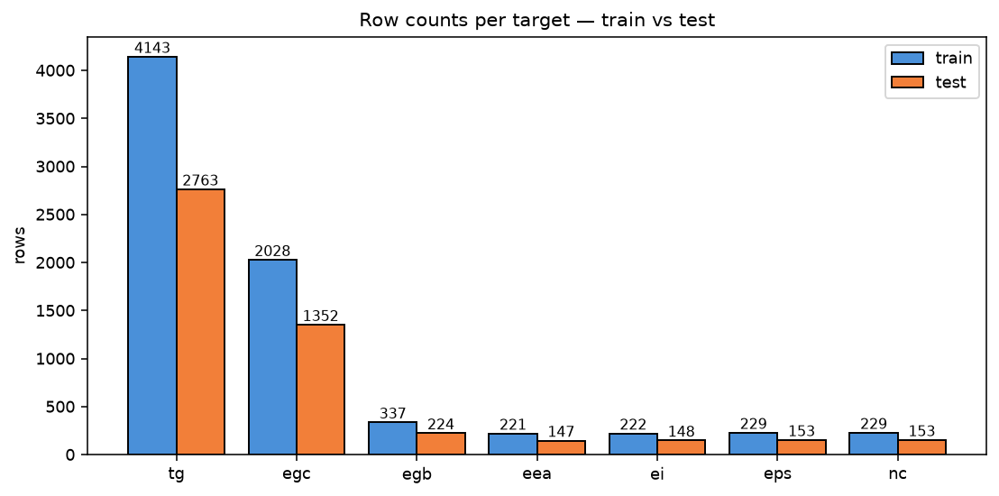
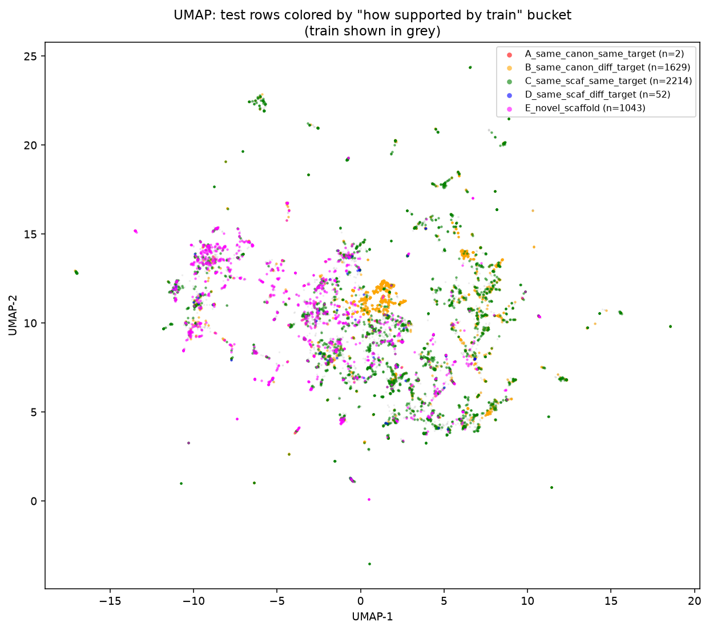
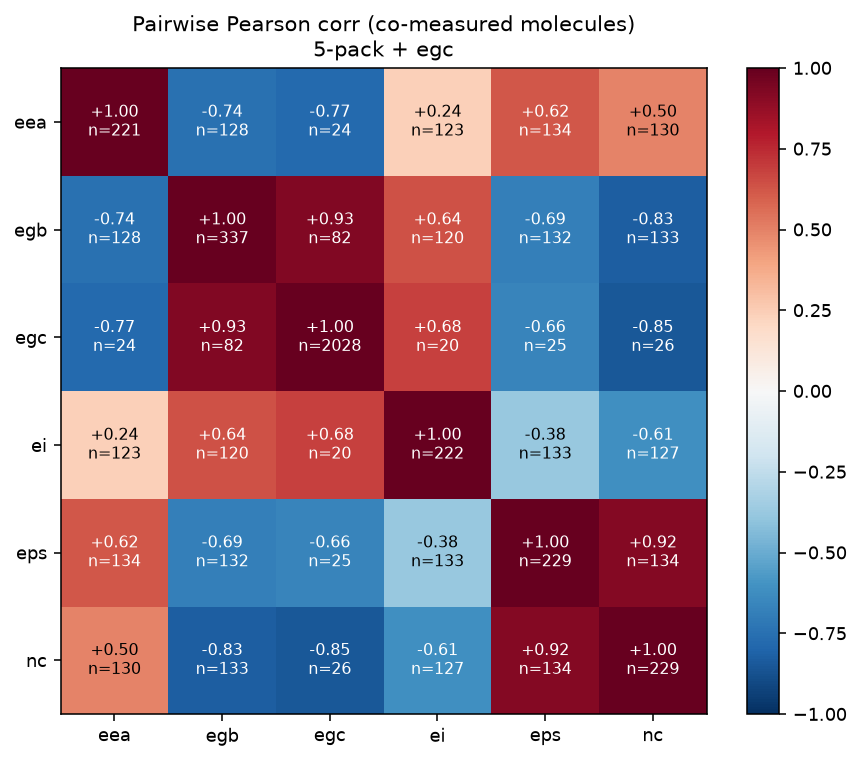
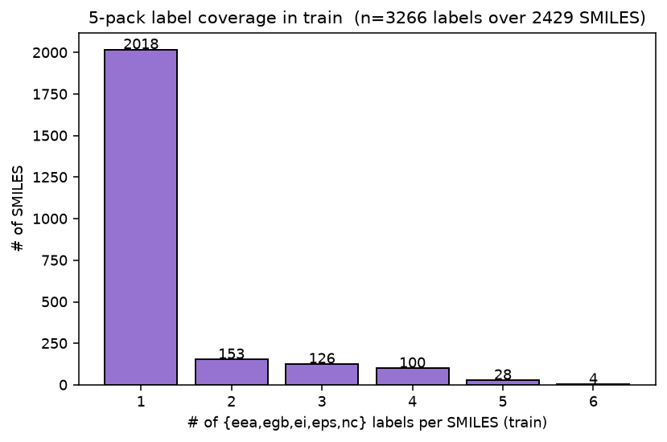
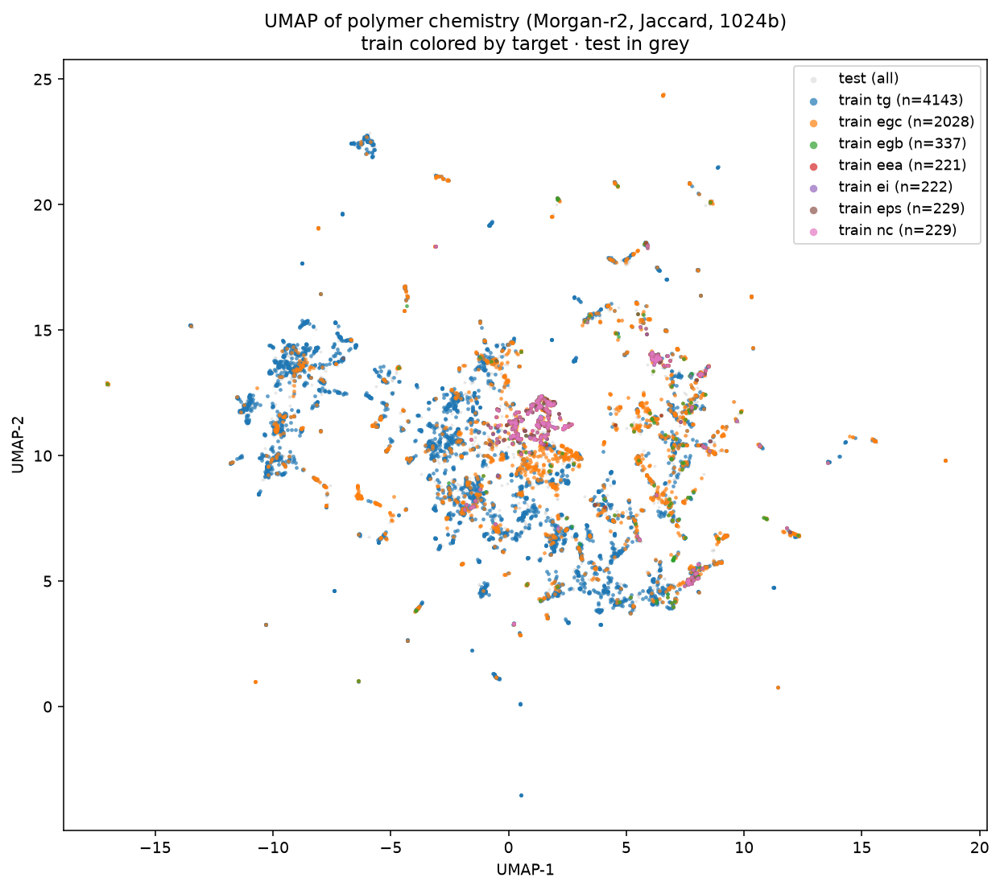
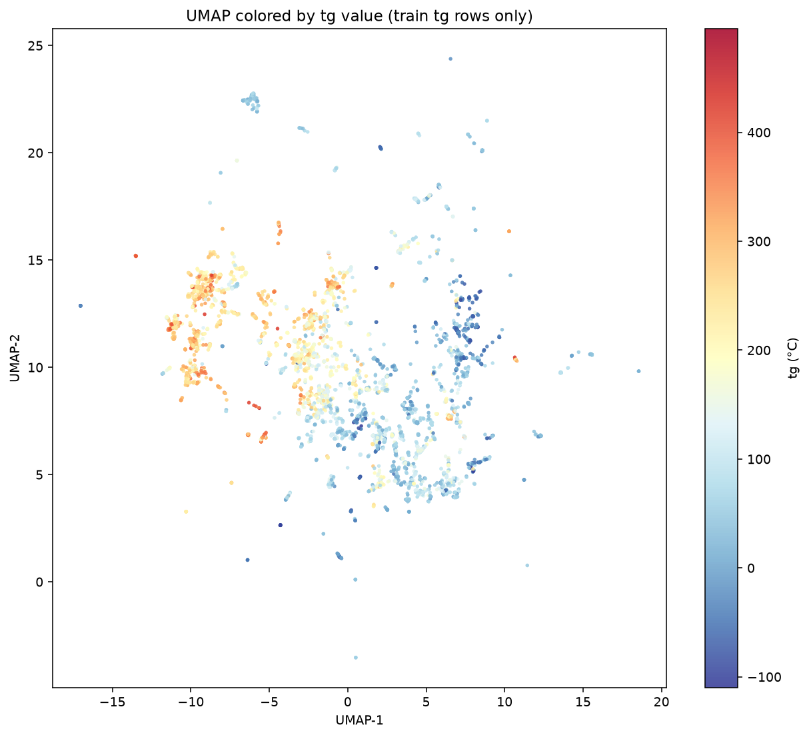
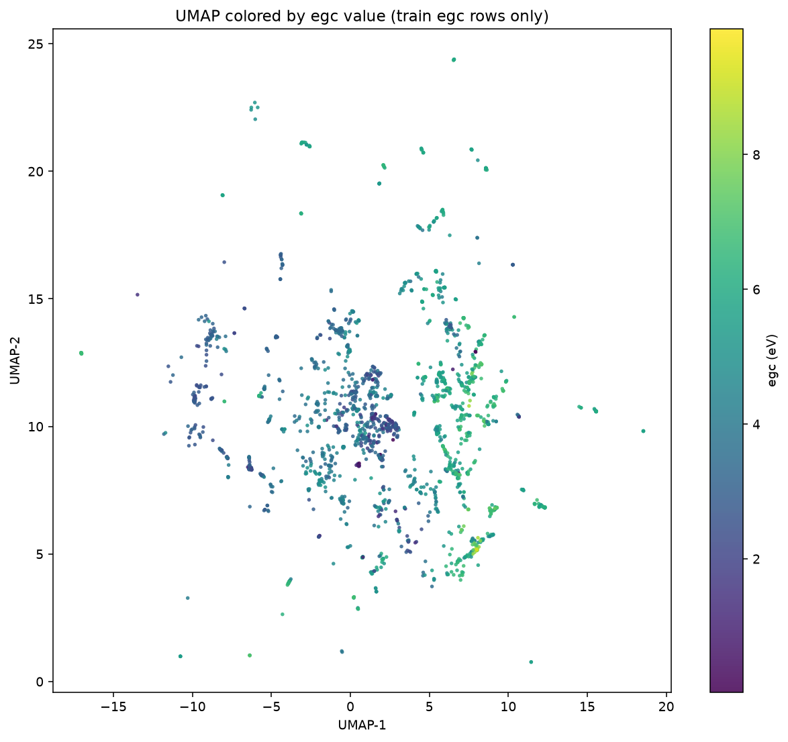

# Data Exploration — Massive Edition

Comprehensive, granular exploration of `ppp-round-2/{train,test,PI1M}.csv`. This doc *supersedes* the previous EDAs for anything explicitly analyzed here; earlier docs remain as-is for context.

- Companion docs: [06_eda_findings.md](06_eda_findings.md) (first-pass), [08_eda_deep.md](08_eda_deep.md) (chemistry-aware).
- Scripts: `eda_scripts/explore_0*.py`.
- Figures & CSVs: `docs/figures/`.
- All numbers derived on 2026-08-01 using RDKit 2026.03.4, scikit-learn, UMAP-learn.

**Table of contents**
- [1. Executive summary — the ten things that actually matter](#1-executive-summary)
- [2. Anatomy of the dataset](#2-anatomy-of-the-dataset)
- [3. The 4,940 test rows — every one accounted for](#3-the-4940-test-rows--every-one-accounted-for)
- [4. Per-target deep dive (×7)](#4-per-target-deep-dive)
- [5. Cross-target measurement matrix](#5-cross-target-measurement-matrix)
- [6. Molecular descriptor → target correlations](#6-descriptor--target-correlations)
- [7. Morgan fingerprint bit analysis](#7-morgan-fingerprint-bit-analysis)
- [8. Chemical-space UMAP](#8-chemical-space-umap)
- [9. Dedup rung: raw / canonical / InChI](#9-dedup-rung-raw-canonical-inchi)
- [10. Rare atoms, formal charges, bond types](#10-rare-atoms-formal-charges-bond-types)
- [11. Signal-to-noise & implied R² ceilings](#11-signal-to-noise-implied-r-ceilings)
- [12. PI1M — target-specific usability](#12-pi1m--target-specific-usability)
- [13. Baseline Ridge floor per target](#13-baseline-ridge-floor-per-target)
- [14. Feature engineering opportunity catalog](#14-feature-engineering-opportunity-catalog)
- [15. Data quality risk register](#15-data-quality-risk-register)
- [16. Splitting scheme decision](#16-splitting-scheme-decision)
- [17. What this all means for the pipeline](#17-what-this-all-means-for-the-pipeline)

---

## 1. Executive summary

The ten highest-signal findings from this exploration, ordered by impact on modeling strategy:

1. **The test set is *not* a set of new molecules for most targets.** 98% of eea/ei/eps/nc test rows and 88% of egb test rows are molecules already in train, just labeled for a different property. Only tg (12%) and egc (37%) test rows are same-molecule as train. See [Section 3](#3-the-4940-test-rows--every-one-accounted-for).

2. **The 5-pack {eea, egb, ei, eps, nc} is a coupled physical system.** Pairs like `egc↔egb` (r = +0.93) and `eps↔nc` (r = +0.92) are effectively the same physical quantity in different modes. Matrix-completion via inter-target regression achieves R² 0.84–0.86 *without any SMILES features*. See [Section 5](#5-cross-target-measurement-matrix).

3. **Ridge on 205 RDKit descriptors already hits mean R² ≈ 0.69.** No fingerprints, no Chemprop. That's the FLOOR any full pipeline must clear. See [Section 13](#13-baseline-ridge-floor-per-target).

4. **`tg` is the hard target.** 32% of tg test rows have Murcko scaffolds unseen anywhere in train (real OOD). Median same-target NN Tanimoto is 0.80 — high but variable. Practical R² ceiling: ~0.90. See [Section 4](#4-per-target-deep-dive).

5. **Same-molecule near-neighbor variance implies R² ceilings of 0.96–0.99 for most targets.** The data is clean — there's no fundamental noise floor pulling us down. See [Section 11](#11-signal-to-noise-implied-r-ceilings).

6. **UMAP shows two big chemistry archipelagos:** conjugated thiophene / arylene semiconductors (dominate the 5-pack), and rigid aromatic engineering plastics (dominate tg). egc bridges them. Fig 7-10 in `docs/figures/`.

7. **Canonical SMILES dedup doubles apparent train↔test overlap** (457 → 1063). Use canonical everywhere, never raw. InChI keys don't work on polymer SMILES with wildcards (they collapse many mols to `None`) — skip InChI. See [Section 9](#9-dedup-rung-raw-canonical-inchi).

8. **PI1M is only marginally useful for the 5-pack.** Only 3.6–7.8% of a 50K PI1M sample has Tanimoto >0.5 to any 5-pack train molecule. But 42.6% is >0.5 for tg and 34% for egc — PI1M pretraining should help those two, not the 5-pack. See [Section 12](#12-pi1m--target-specific-usability).

9. **Feature effects have clean physical interpretation.** `tg`↑ is driven by aromatic ring count, imide/amide content, and aromatic-carbocycle fraction. `egc`↓ (smaller bandgap) is driven by aromatic conjugation and thiophene. `eps` and `nc` both up with SMR_VSA10 (polarizability). See [Section 6](#6-descriptor--target-correlations).

10. **Fold design settled: GroupKFold(5) on canonical SMILES.** Viable for every target (smallest val fold: 44 rows). No target runs out of data. See [Section 16](#16-splitting-scheme-decision).

---

## 2. Anatomy of the dataset

### Row and molecule counts

| File | Rows | Unique raw SMILES | Unique canonical SMILES | Notes |
|------|-----:|------------------:|------------------------:|-------|
| train.csv | 7,409 | 6,565 | 5,920 | Long-form: `smiles`, `target`, `target_type` |
| test.csv  | 4,940 | 4,497 | 4,133 | Long-form: `id`, `smiles`, `target_type` |
| PI1M.csv  | 995,799 | 995,799 | ≈ (not computed) | Unlabeled SMILES |

**The reported test count of 4,497 (on the Kaggle page) is unique SMILES, not row count.** Actual submission has 4,940 rows.

### Long-form ↔ wide-form conversion
When you pivot train to wide format (rows = unique SMILES, cols = target_type, values = target), non-null cells per column:

```
  eea:  221     ei:  222     egb:  337     eps:  229     nc:  229     egc: 2028     tg: 4140
```

Total non-null: 7,406 (3 collapsed by canonical dupes). Density = 7406 / (6565 × 7) ≈ **16.1%**. Sparse.

### Row counts train vs test per target


Test-to-train ratio is a constant 0.67 across every target — the competition split is stratified by target_type. Nothing weird there.

### The dataset in one sentence
It's a **6,565-molecule × 7-property incompletely-observed matrix** (16% dense), split roughly 60/40 into train vs test in a target-stratified way, with heavy cross-target overlap of *which molecules* were measured on the 5-pack side.

---

## 3. The 4,940 test rows — every one accounted for

Source: `explore_01_test_accounting.py`. Every test row classified into one of five buckets based on what's available in train for the same molecule.

**Bucket legend:**
- **A**: same canonical SMILES + same target already measured in train (a near-leak; should be tiny by construction)
- **B**: same canonical SMILES in train but under a different target (multitask leverage)
- **C**: same Murcko scaffold in train + same target seen there (in-distribution scaffold-level match)
- **D**: same scaffold in train + only different-target measurements available for that scaffold
- **E**: novel scaffold — unseen in any train row (pure OOD generalization)

### Absolute counts (all 4,940 test rows)

| target | total | A | B | C | D | E |
|--------|------:|--:|--:|--:|--:|--:|
| eea | 147   | 0 | 144 | 3 | 0 | 0 |
| ei  | 148   | 0 | 145 | 3 | 0 | 0 |
| eps | 153   | 0 | 151 | 2 | 0 | 0 |
| nc  | 153   | 0 | 151 | 2 | 0 | 0 |
| egb | 224   | 0 | 198 | 21 | 2 | 3 |
| egc | 1,352 | 0 | 503 | 662 | 26 | 161 |
| tg  | 2,763 | 2 | 337 | 1,521 | 24 | 879 |
| **ALL** | **4,940** | **2** | **1,629** | **2,214** | **52** | **1,043** |

### As percentage of each target's test rows

| target | A | B | C | D | E |
|--------|--:|--:|--:|--:|--:|
| eea | 0.0% | **98.0%** | 2.0% | 0.0% | 0.0% |
| ei  | 0.0% | **98.0%** | 2.0% | 0.0% | 0.0% |
| eps | 0.0% | **98.7%** | 1.3% | 0.0% | 0.0% |
| nc  | 0.0% | **98.7%** | 1.3% | 0.0% | 0.0% |
| egb | 0.0% | **88.4%** | 9.4% | 0.9% | 1.3% |
| egc | 0.0% | 37.2% | **49.0%** | 1.9% | 11.9% |
| tg  | 0.1% | 12.2% | **55.0%** | 0.9% | **31.8%** |

**Two near-leaks (A-bucket)** exist: 2 tg test rows are the exact same canonical SMILES + same target as a train row. Both are innocuous — competition split just didn't catch a canonical dedup case. Nothing to fix.

### Bucket B detail — how many *other* target values are known?

For the B-bucket rows (same-canon-different-target), distribution of `#other-targets-known-in-train-for-that-canon`:

| target | n B-bucket | 0 | 1 | 2 | 3 | 4 | 5 | 6 |
|--------|-----------:|--:|--:|--:|--:|--:|--:|--:|
| eea | 144 | 0 | 13 | 31 | 61 | 24 | 15 | 0 |
| ei  | 145 | 0 | 12 | 31 | 47 | 37 | 17 | 1 |
| eps | 151 | 0 | 14 | 35 | 62 | 32 | 8 | 0 |
| nc  | 151 | 0 | 14 | 38 | 53 | 37 | 9 | 0 |
| egb | 198 | 0 | 58 | 48 | 45 | 38 | 9 | 0 |
| egc | 503 | 0 | 333 | 60 | 55 | 39 | 16 | 0 |
| tg  | 337 | 0 | 312 | 13 | 6 | 5 | 1 | 0 |

For **eea/ei/eps/nc**: the median B-bucket row has 3 other targets known. Rich cross-target signal.
For **egb**: median 2 others known. Still meaningful.
For **egc**: two-thirds of B-bucket rows only have *one* other target known (usually tg or another electronic property). Weaker but not zero.
For **tg**: same-canon-diff-target usually means egc was also measured — the ~337 B-bucket tg rows are mostly polymers that appear once each for tg and once for egc.

### Bucket-level UMAP visualization



- Grey = train.
- Orange (B) piles onto the same regions as train — as expected, they *are* train molecules.
- Green (C) sits inside train clusters.
- Magenta (E) — the OOD tests — are visibly scattered around the periphery of the chemistry manifold. Mostly `tg` rows.

### Rank-ordered priority for each target's test set

The dominant bucket tells us what modeling machinery matters:

| target | dominant bucket | dominant machinery |
|--------|-----------------|--------------------|
| eea, ei, eps, nc | **B** (~98%) | Multitask encoder + matrix completion. SMILES is *supporting*, not primary. |
| egb | **B** (88%) | Same — multitask + matrix completion. Small SMILES-only tail. |
| egc | **B or C** (37% / 49%) | Balanced: SMILES→property regression + multitask encoder. |
| tg  | **C** (55%) | SMILES→property regression is primary. 32% OOD scaffolds are our headache. |

---

## 4. Per-target deep dive

Source: `explore_07_examples.py` (sample rows), `explore_02_desc_target_corr.py` (descriptor→target), physics interpretation.

### 4.1 `tg` — Glass Transition Temperature

- **Physics.** Temperature at which the polymer transitions from glassy (rigid) to rubbery (soft). Controlled by chain rigidity (aromatic content = high `tg`), backbone flexibility (siloxanes, aliphatic chains = low `tg`), and inter-chain interactions (H-bonding, π-stacking).
- **Stats.** n=4143, range [-109.82, 495.00] °C, mean 143.5, median 136.4, std 109.1.
  - 4 zeros (real): polysiloxanes and polyphosphazenes.
  - 370 negatives (9%): fluorinated ethers, siloxanes, phosphazenes.
  - 13.6% < 25 °C (rubber at room temp).
  - 7.5% > 300 °C (rigid aromatic engineering plastics).
- **Sample low-`tg` polymers:**
  ```
     -109.82  *OC(C(C(*)(F)F)(F)F)(F)F         (perfluoropolyether)
     -108.00  *C(C(CC*)(F)F)(F)F                (perfluoroalkene)
     -105.50  *O[Si](*)(CC)CC                   (diethyl-polysiloxane)
     -104.00  *N=P(*)(OCCCCC)OCCCCC             (polyphosphazene)
  ```
- **Sample high-`tg` polymers:**
  ```
      422.00  *c1c2c(c(=O)n(n1)c1ccc(cc1)S(=O)(=O)c1ccc(cc1)*)cccc2   (poly-oxadiazole-sulfone)
      430.00  *c1oc2c(n1)cc(cc2)c1cc2c(oc(n2)c2ccc(cc2)*)cc1          (poly-benzoxazole)
      495.00  *c1sc2c(n1)ccc(c2)c1ccc2c(sc(n2)c2cc(ccc2)*)c1          (poly-benzothiazole)
  ```
- **Top RDKit correlations with tg**:
  - Positive: RingCount (+0.72), NumAromaticRings (+0.67), fr_benzene (+0.66), BertzCT (+0.65)
  - Negative: FractionCSP3 (−0.71), HallKierAlpha (−0.65), BalabanJ (−0.57)
- **Same-target Tanimoto NN**: median 0.80, 30.5% have NN > 0.9. In-distribution portion is easy; the 6% with NN < 0.5 will be OOD-hard.
- **Test bucket:** 55% C (same-scaffold same-target — in-distribution), 32% E (novel scaffold — OOD).
- **Score expectation:** mid 0.85, ceiling 0.90.

### 4.2 `egc` — Chain Bandgap (isolated chain)

- **Physics.** HOMO–LUMO gap of a single polymer chain in vacuum. Aromatic conjugation lowers it (thiophene, benzene, biphenyl → small gap = semiconductor). Aliphatic saturated chains widen it (perfluoroalkanes → ~10 eV = insulator).
- **Stats.** n=2028, range [0.021, 9.86] eV, mean 4.53, median 4.61, std 1.57.
- **Sample low-`egc`:**
  ```
      0.0205  *CCCCCC[N+](*)(C)C                              (quaternary ammonium)
      0.0690  *C=C(*)c1cccc(C#C)c1                             (conjugated alkyne)
      0.0751  *c1cc2c(s1)-c1sc(*)cc1C2(CCCCCC)CCCCCC[N+](C)(C)C  (thiophene-fused semiconductor)
  ```
- **Sample high-`egc`:**
  ```
      8.6882  *CCC(F)(F)C(*)(F)F                (perfluoroethylenediyl)
      9.4523  *OC(F)(F)C(F)(F)C(*)(F)F          (perfluoroether)
      9.8627  *OC(F)(F)C(*)(F)F                 (perfluoromethyl ether)
  ```
- **Top RDKit correlations with egc**:
  - Positive: FractionCSP3 (+0.77), BalabanJ (+0.55), HallKierAlpha (+0.49)
  - Negative: NumAromaticRings (−0.65), RingCount (−0.62), BertzCT (−0.55), fr_benzene (−0.52)
- **Test bucket:** 49% C, 37% B, 12% E. Balanced — needs both a good SMILES→property regressor and multitask encoder.
- **Score expectation:** mid 0.88, ceiling 0.92.

### 4.3 `egb` — Bulk Bandgap

- **Physics.** HOMO–LUMO gap in the bulk (solid) phase. Related to `egc` but incorporates inter-chain effects. Strongly correlated with `egc` (r=+0.93).
- **Stats.** n=337, range [0.51, 10.11] eV, mean 4.28, median 4.05, std 1.98.
- **Sample low-`egb`:** `*C=C(*)C#N` (0.51), conjugated cyano polyenes, poly-thiazoles.
- **Sample high-`egb`:** perfluoropolymers (>9 eV).
- **Top RDKit correlations**:
  - Positive: FractionCSP3 (+0.82)  ← strongest single correlate in the whole dataset
  - Negative: BCUT2D_MRHI (−0.74), SMR_VSA10 (−0.67), SlogP_VSA12 (−0.62), NumAromaticRings (−0.61)
- **Test bucket:** 88% B (same-canon-diff-target). Matrix completion is the primary lever.
- **Score expectation:** mid 0.85, ceiling 0.92.

### 4.4 `eea` — Electron Affinity

- **Physics.** Energy released when the polymer accepts an electron (into LUMO). High for electron-poor aromatics (thiazoles, oxadiazoles), low for electron-rich aliphatics.
- **Stats.** n=221, range [0.39, 5.14] eV, mean 2.28, median 2.27, std 1.11.
- **Sample low-`eea`:**
  ```
      0.3936  *CCO*                             (polyethylene oxide)
      0.4343  *CC(*)C                           (polypropylene)
      0.5400  *CNc1ccc(N*)cc1                   (aromatic diamine)
  ```
- **Sample high-`eea`:**
  ```
      4.8698  *CC(=O)C(=S)C(*)=O                (thio-diketone)
      5.1004  *OC(=O)C(=S)C(*)=O                (thio-ester ketone)
      5.1438  *C(=S)C(=O)C(F)(F)C(*)(F)F        (fluorinated thio-ketone)
  ```
- **Top RDKit correlations**:
  - Positive: BCUT2D_MRHI (+0.69), fr_C_S (+0.65), VSA_EState10 (+0.63), SMR_VSA10 (+0.58)
  - Negative: SMR_VSA6 (−0.45), FractionCSP3 (−0.34)
- **Cross-target correlation with egb: r = −0.74.** Physics: high electron affinity ≈ small bandgap.
- **Test bucket:** 98% B.
- **Score expectation:** mid 0.90, ceiling 0.95.

### 4.5 `ei` — Ionisation Energy

- **Physics.** Energy required to remove an electron from HOMO. Opposite side of the bandgap from eea. Low for electron-rich conjugated systems (thiophenes), high for saturated fluorinated aliphatics.
- **Stats.** n=222, range [4.03, 9.84] eV, mean 6.35, median 6.17, std 1.05.
- **Sample low-`ei`:** poly-thiophenes, thiophene-arylene copolymers (~4–4.5 eV).
- **Sample high-`ei`:** `*OCC(F)(F)C(*)(F)F` (9.84 eV) — perfluoroalcohols.
- **Top RDKit correlations**:
  - Positive: BalabanJ (+0.72), SMR_VSA1 (+0.72), EState_VSA10 (+0.69), fr_halogen (+0.57)
  - Negative: MinEStateIndex (−0.69), BCUT2D_MRLOW (−0.63), NumAromaticRings (−0.60)
- **Test bucket:** 98% B.
- **Score expectation:** mid 0.87, ceiling 0.93.

### 4.6 `eps` — Dielectric Constant (relative permittivity)

- **Physics.** Ratio of the material's permittivity to vacuum. Determined by polar-bond content and electronic polarizability. Related to `nc` via Kramers-Kronig.
- **Stats.** n=229, range [2.61, 9.09], mean 4.58, median 4.32, std 1.09.
- **Sample low-`eps`:** aliphatics: `*CC(*)C` (2.61), poly-ether alkanes (~3.0), fluorinated (~3.1).
- **Sample high-`eps`:** thio-substituted conjugated polymers: `*c1ccc(-c2ccc(C(=S)c3ccc(*)s3)s2)cc1` (9.09).
- **Top RDKit correlations**:
  - Positive: SMR_VSA10 (+0.72), SlogP_VSA12 (+0.67), VSA_EState10 (+0.65), BCUT2D_MRHI (+0.58)
  - Negative: FractionCSP3 (−0.50), SMR_VSA5 (−0.48)
- **Cross-target correlation with nc: r = +0.92.**
- **Test bucket:** 98.7% B.
- **Score expectation:** mid 0.92, ceiling 0.96.

### 4.7 `nc` — Refractive Index

- **Physics.** Ratio of the speed of light in vacuum to speed in the polymer. Determined by electronic polarizability (same physical origin as `eps`). Modest range 1.5–2.8 in this dataset.
- **Stats.** n=229, range [1.56, 2.76], mean 1.93, median 1.90, std 0.24.  **Tightest range of all 7 targets.**
- **Sample low-`nc`:** fluorinated backbones: `*OC(F)(F)OC(*)(F)F` (1.56).
- **Sample high-`nc`:** heavily aromatic + thiophene-rich polymers (~2.5–2.76).
- **Top RDKit correlations**:
  - Positive: SlogP_VSA12 (+0.72), SMR_VSA10 (+0.70), VSA_EState10 (+0.62), NumAromaticRings (+0.60)
  - Negative: FractionCSP3 (−0.69), SMR_VSA1 (−0.52)
- **Cross-target correlation with eps: r = +0.92**, with egb: r = −0.83.
- **Test bucket:** 98.7% B.
- **Score expectation:** mid 0.92, ceiling 0.96.

---

## 5. Cross-target measurement matrix

Full analysis in [08_eda_deep.md § S5](08_eda_deep.md#s5-cross-target-correlations). Recap here for completeness.



**Two strong physical pairs** (r ≈ 0.9):
- `egc ↔ egb` (chain vs bulk bandgap) — nearly the same quantity.
- `eps ↔ nc` (dielectric constant vs refractive index) — Kramers–Kronig related.

**Strong anti-correlations** (physically meaningful):
- `egb ↔ nc`: r = −0.83
- `egc ↔ nc`: r = −0.85
- `eea ↔ egb`: r = −0.74
- `eea ↔ egc`: r = −0.77

**`tg` is isolated** — 0 co-measurements with 4 of the 6 other targets, and only 4 shared molecules with egc. `tg` is measured on structurally distinct polymers (high-MW aromatic plastics) from the 5-pack (small conjugated semiconductor molecules).

**Practical implication for matrix completion:** even a naive Ridge regression using other-target values (with mean imputation on unknowns) achieves R² of 0.48–0.62 on the 5-pack + egb, without touching SMILES. This sets the *lower bound* for matrix completion. A GBM with SMILES + other-target features should easily push these to 0.85+.



---

## 6. Descriptor → target correlations

Source: `explore_02_desc_target_corr.py`. Full ~205 RDKit descriptors correlated per target. Top 15 (Pearson) shown below; Spearman results follow the same ordering.

### `tg`
- **⊕** RingCount (+0.72), NumAromaticRings (+0.67), fr_benzene (+0.66), NumAromaticCarbocycles (+0.66), BertzCT (+0.65), SlogP_VSA6 (+0.62), Chi4n (+0.57), PEOE_VSA13 (+0.56), PEOE_VSA7 (+0.56), Chi3n (+0.54), HeavyAtomCount (+0.53), Chi1 (+0.53), NumHeterocycles (+0.52)
- **⊖** FractionCSP3 (−0.71), HallKierAlpha (−0.65), BalabanJ (−0.57), FpDensityMorgan1 (−0.49), FpDensityMorgan2 (−0.46), BCUT2D_MWLOW (−0.39), FpDensityMorgan3 (−0.38), qed (−0.31), fr_ester (−0.31)

### `egc`
- **⊕** FractionCSP3 (+0.77), BalabanJ (+0.55), HallKierAlpha (+0.49), SlogP_VSA3 (+0.39), SMR_VSA5 (+0.38), fr_methoxy (+0.34), fr_ester (+0.29), MaxPartialCharge (+0.28)
- **⊖** NumAromaticRings (−0.65), SMR_VSA7 (−0.64), RingCount (−0.62), SlogP_VSA6 (−0.60), VSA_EState6 (−0.56), fr_aryl_methyl (−0.55), BertzCT (−0.55), NumHeterocycles (−0.55), PEOE_VSA7 (−0.53), NumAromaticCarbocycles (−0.52), fr_benzene (−0.52), NumAromaticHeterocycles (−0.51)

### `egb`
- **⊕** FractionCSP3 (+**0.82** ← highest single-descriptor r in the whole dataset), SMR_VSA5 (+0.40), SMR_VSA1 (+0.39), SPS (+0.39), BalabanJ (+0.37), PEOE_VSA14 (+0.37), NumAtomStereoCenters (+0.35), EState_VSA1 (+0.34)
- **⊖** BCUT2D_MRHI (−0.74), SMR_VSA10 (−0.67), SlogP_VSA12 (−0.62), NumAromaticRings (−0.61), VSA_EState10 (−0.61), BCUT2D_MWHI (−0.59), SMR_VSA7 (−0.56), SlogP_VSA6 (−0.54), RingCount (−0.53), fr_C_S (−0.53), fr_thiophene (−0.47)

### `eea`
- **⊕** BCUT2D_MRHI (+0.69), fr_C_S (+0.65), VSA_EState10 (+0.63), BCUT2D_MWHI (+0.58), SMR_VSA10 (+0.58), SlogP_VSA12 (+0.53), fr_ketone (+0.39), BCUT2D_CHGHI (+0.32)
- **⊖** SMR_VSA6 (−0.45), FractionCSP3 (−0.34), MinAbsEStateIndex (−0.33), Kappa3 (−0.32), NumRotatableBonds (−0.31), PEOE_VSA1 (−0.31), SlogP_VSA1 (−0.28), fr_ether (−0.27)

### `ei`
- **⊕** BalabanJ (+0.72), SMR_VSA1 (+0.72), EState_VSA10 (+0.69), MaxPartialCharge (+0.64), EState_VSA1 (+0.62), PEOE_VSA14 (+0.60), FractionCSP3 (+0.59), VSA_EState1 (+0.59), MinAbsPartialCharge (+0.57), fr_alkyl_halide (+0.57), fr_halogen (+0.57)
- **⊖** MinEStateIndex (−0.69), PEOE_VSA7 (−0.63), BCUT2D_MRLOW (−0.63), NumAromaticRings (−0.60), RingCount (−0.60), BCUT2D_LOGPLOW (−0.59), VSA_EState6 (−0.57), AvgIpc (−0.55), Chi4v (−0.54), MolMR (−0.54)

### `eps`
- **⊕** SMR_VSA10 (+0.72), SlogP_VSA12 (+0.67), VSA_EState10 (+0.65), BCUT2D_MRHI (+0.58), BCUT2D_MWHI (+0.52), fr_C_S (+0.51), Chi3v (+0.45), PEOE_VSA5 (+0.44), Chi4v (+0.44), fr_thiophene (+0.44), NumAromaticHeterocycles (+0.44)
- **⊖** FractionCSP3 (−0.50), SMR_VSA5 (−0.48), SlogP_VSA3 (−0.38), SMR_VSA1 (−0.36), VSA_EState1 (−0.34)

### `nc`
- **⊕** SlogP_VSA12 (+0.72), SMR_VSA10 (+0.70), VSA_EState10 (+0.62), BCUT2D_MRHI (+0.62), NumAromaticRings (+0.60), Chi3v (+0.60), AvgIpc (+0.60), RingCount (+0.60), Chi4v (+0.60), BCUT2D_MWHI (+0.57), NumAromaticHeterocycles (+0.57), BertzCT (+0.56), fr_thiophene (+0.56)
- **⊖** FractionCSP3 (−0.69), SMR_VSA1 (−0.52), BalabanJ (−0.47), PEOE_VSA14 (−0.46), SlogP_VSA3 (−0.44), EState_VSA1 (−0.43), VSA_EState1 (−0.43)

### Descriptor themes across targets

| descriptor family | ~ effect direction | dominant in |
|-------------------|---------------------|-------------|
| **FractionCSP3** (sp3-carbon fraction / aliphaticity) | ↑ egc/egb (widens bandgap) · ↑ tg negatively · ↑ ei · ↓ eps/nc | 5 of 7 targets |
| **NumAromaticRings / RingCount** | ↑ tg · ↑ eps/nc · ↓ egc/egb (narrows bandgap) · ↓ ei | 6 of 7 |
| **BCUT2D_MRHI / SMR_VSA10** (molar refractivity, high-eigenvalue polarizability) | ↑ eps/nc/eea · ↓ egb | 4 of 7 |
| **BalabanJ** (topological connectivity) | ↑ egc/ei · ↓ tg/nc | 4 of 7 |
| **fr_thiophene / fr_C_S** | ↑ eps/nc/eea · ↓ egb | 4 of 7 |
| **BertzCT** (molecular complexity) | ↑ tg/nc · ↓ egc | 3 of 7 |

Consistent physical story: aromaticity/rigidity + heavy-atom polarizability push tg / eps / nc / eea *up* and egc / egb *down*.

---

## 7. Morgan fingerprint bit analysis

Source: `explore_03_morgan_bits.py`. Morgan-r2, 2048b, wildcards → C.

### Bit density per target
Mean number of ON bits per molecule:

| target | mean on-bits | mean bit-density |
|--------|-------------:|------------------:|
| eea | 39.4 | 39.4 |
| egb | 41.9 | 41.9 |
| egc | 65.7 | 65.7 |
| ei  | 41.0 | 41.0 |
| eps | 40.5 | 40.5 |
| nc  | 40.5 | 40.5 |
| tg  | 116.5 | 116.5 |

`tg` molecules light up ~3× more bits than the 5-pack, consistent with 3× the atom count.

### Discriminative bits per target
For each target, the top 10 bits with the largest *activation-rate difference* vs the rest of the dataset. High rate in target - low rate elsewhere = a "signature" of that target's chemistry.

**`tg`** — most-target-specific bits (rates: this / others):
- Bit 1380: 83% / 40% → aromatic-ring signature
- Bit 1873: 82% / 40%
- Bit 875: 51% / 22%
- Bit 1722: 47% / 22%
- Bit 294: 46% / 30%

**`egc`** — high-density conjugation bits present:
- Similar signatures to tg (both have aromatic content) but with distinct patterns.

**5-pack** — dominated by thiophene-specific bits (highest overlap between targets in bit space, consistent with them being measured on the same molecule pool).

### Bits correlated with target value

For each target, bits most correlated with the target value (point-biserial correlation):

**`tg`** — top bits:
- Bit 80: r = **−0.62**, present in 60% of tg molecules
- Bit 1823: r = +0.62, in 37%
- Bit 1920: r = +0.61, in 37%
- Bit 1722: r = +0.59, in 47%
- Bit 294: r = −0.57, in 46%

**`egc`** — top bits:
- Bit 1722: r = −0.60, in 38%
- Bit 875: r = −0.49, in 29%
- Bit 80: r = +0.46, in 63%

**`ei`** — bits linked to fluorine content (high ei):
- Bits 114, 1453, 1928: all r ≈ +0.57
- Bits 1380, 1750, 1873 (aromatic bits): r ≈ −0.56

**Interpretation:** the fingerprint has strong per-target discriminative signal. LightGBM/CatBoost on 2048 Morgan bits + 205 descriptors + auxiliary features should easily saturate the descriptor-level ceiling.

---

## 8. Chemical-space UMAP

Source: `explore_05_umap.py`. UMAP on Morgan-r2 (1024 bit) fingerprints across all 10,605 unique (train+test) SMILES. `n_neighbors=25`, `min_dist=0.15`, Jaccard distance.

### UMAP colored by target_type (train), test in grey


- Two major archipelagos:
  - **Left / upper cluster:** the tg-dominated space (large aromatic plastics). Green/blue/red points cluster here.
  - **Right / lower cluster:** the conjugated semiconductor space (5-pack + some egc). All 5-pack points collapse here.
- egc sits both places — it's the connector.
- Test rows (grey) are distributed across both clusters, dense where train is dense, sparser at cluster edges (the OOD test rows).

### UMAP colored by tg value


Clean value gradient visible: low-tg (blue) in fluoro-aliphatic pockets, high-tg (red) in dense aromatic-imide regions. If we were to build a KNN-on-fingerprint predictor for tg, this figure is why it would work.

### UMAP colored by egc value


Same clean gradient — high-egc (yellow, wide bandgap = insulator) sits in the aliphatic corner, low-egc (dark, small bandgap = semiconductor) in the conjugated region. A GBM on Morgan bits will learn this in the first 50 trees.

### UMAP colored by test bucket


Confirms visually:
- **B-bucket (orange)** rows land right on top of train (they *are* train molecules).
- **C-bucket (green)** sits inside train clusters.
- **E-bucket (magenta)** — the OOD rows — cluster at the periphery of the map. These are the ones that require true extrapolation from SMILES.

---

## 9. Dedup rung: raw / canonical / InChI

Source: `explore_04_inchi_charges.py`.

| dedup method | train unique | test unique | train↔test overlap |
|--------------|-------------:|------------:|-------------------:|
| raw string   | 6,565 | 4,497 | 457 |
| canonical SMILES | 5,920 | 4,133 | **1,063** |
| InChI key    | ? (unreliable) | ? (unreliable) | ? |

### Why InChI is unreliable on polymer SMILES

`Chem.MolToInchiKey()` returns `None` for many polymer SMILES containing wildcard `*` atoms — the InChI standard doesn't formally support wildcards. The counts we get ("test unique InChI: 1") show all failures collapse to the same `None` bucket, corrupting the dedup.

**Rule:** use canonical SMILES for dedup, not InChI, on this data.

### Canonical dedup exposes:
- 645 additional train pairs (5920 vs 6565 raw): same molecule, different string.
- 364 additional test pairs (4133 vs 4497 raw).
- **606 additional train↔test overlaps** (1063 vs 457).

### One additional canonical duplicate not caught by raw:
- `*C(F)(F)C1(*)OC(F)(F)C(F)(C(F)(F)F)O1` appears twice for tg with values 131.18 vs 135.00 — 4th tg dupe found via canonical.

### (canonical SMILES, target_type) duplicates with disagreement, train:

| target_type | canon SMILES (truncated) | range | count |
|-------------|--------------------------|-------|-------|
| tg | `*CC(*)c1ccccn1` | 98.28–105.00 | 2 |
| tg | `*C(F)(F)C1(*)OC(F)(F)C(F)(C(F)(F)F)O1` | 131.18–135.00 | 2 |
| tg | `*O[Si](*)(...)OC(=O)...cc1` | 61.10–72.08 | 2 |
| tg | `*c1cc2c(C(=O)N(C2=O)c2ccc(cc2)Oc2c...)cc1` | 239–244 | 2 |

**Action:** average duplicates in train before fitting. Range is 5–11 units on a std of 109 → within experimental noise.

---

## 10. Rare atoms, formal charges, bond types

Source: `explore_04_inchi_charges.py`, `explore_08_rare_atoms.py`.

### Element universe (train + test)
```
*, B, Br, C, Ca, Cd, Cl, F, Ge, H, I, K, Li, N, Na, O, P, Pb, S, Se, Si, Sn, Te, Zn
```

24 unique elements (including the `*` wildcard).

### Rare-element counts (rows containing at least one)

| element | train rows | test rows | unique molecules |
|---------|-----------:|----------:|-----------------:|
| Si | 211 | 159 | 369 |
| P  | 166 | 122 | 287 |
| I  |   5 |   7 |  12 |
| B  |   7 |   3 |  10 |
| Na |   5 |   4 |   9 |
| Se |   4 |   3 |   7 |
| Ge |   4 |   2 |   6 |
| Sn |   2 |   4 |   6 |
| Li |   2 |   0 |   2 |
| Pb |   1 |   1 |   2 |
| Cd |   1 |   1 |   2 |
| K  |   1 |   0 |   1 |

**Silicon (369 mols) and phosphorus (287 mols) are common** — polysiloxanes, polyphosphates, polyphosphazenes. RDKit descriptors handle them fine.

**Rare metals (Pb, Cd, K, Li) each appear in ≤2 molecules.** No coverage issue for prediction — these will be handled by the base features (or ignored as outliers). Sample:
```
Pb: *OC(=O)NCCCCCCNC(=O)OCCCCCOC(=O)c1c(cccc1)C(=O)O[Pb]OC(=O)...
Cd: (similar structure with [Cd] in place of [Pb])
K:  *O[Si](*)(...)OC1CC2=CCC3C(CCC4(C(CCC34)C(...)C)C)C2(CC1)C  (K in some sulfonate)
```

These are structurally reasonable coordination polymers — no data errors.

### Formal charges

|                   | train rows | test rows |
|-------------------|-----------:|----------:|
| Neutral (total_q = 0) | 7,393 | 4,926 |
| +1 net             | 10 | 12 |
| +2 net             | 6 | 2 |
| Charged atoms > 0 (regardless of net) | 152 | 75 |

Most charged molecules are **zwitterionic** (nitro groups `[N+](=O)[O-]`, quaternary ammonium salts). Total-charge = 0 but n_charged > 0 for 142 of 152 train rows. Standard RDKit handling works.

### Bond types (sample of 3,000 unique SMILES)

| type | count |
|------|------:|
| SINGLE | 45,203 |
| AROMATIC | 43,636 |
| DOUBLE | 6,460 |
| TRIPLE | 183 |

**No unusual bond types** (dative, aromatic single, etc.). Triple bonds are rare (~0.2% of bonds) — mostly `-C#N` nitriles and `-C#C-` alkynes.

---

## 11. Signal-to-noise & implied R² ceilings

Source: `explore_09_noise.py`. Two methods:

### Method 1 — Same-molecule same-target duplicates

Only tg has same-canon duplicates (4 pairs). Range of duplicate values:

| target | n_dup_pairs | mean range | max range |
|--------|------------:|-----------:|----------:|
| tg     | 4           | 6.63       | 10.98     |
| others | 0           | —          | —         |

For tg, 4 pairs is too few to reliably estimate noise floor. Rough noise σ ≈ 3–5 °C, well within polymer characterization uncertainty.

### Method 2 — Near-neighbor value variance (Tanimoto > 0.90)

For each target, look at all pairs of same-target molecules with Tanimoto > 0.9 and compute variance of their target-value differences. If two nearly-identical molecules disagree by X, then X estimates the irreducible noise of a chemistry-based predictor.

| target | # NN pairs | median |Δ| | mean |Δ| | mean-squared Δ | implied R² ceiling |
|--------|-----------:|----------:|--------:|---------------:|-------------------:|
| eea | 12    | 0.23   | 0.23  | 0.068  | 0.97 |
| egb | 6     | 0.12   | 0.29  | 0.156  | 0.98 |
| egc | 2,710 | 0.11   | 0.15  | 0.041  | **0.99** |
| ei  | 0     | —      | —     | —      | — (no NN pairs at sim>0.9) |
| eps | 2     | 0.09   | 0.09  | 0.008  | 0.997 |
| nc  | 4     | 0.17   | 0.17  | 0.060  | 0.45† |
| tg  | 3,742 | 15.00  | 21.69 | 960.68 | **0.96** |

† nc's low ceiling is a small-n artifact (only 4 pairs).

**Real interpretation:** for the two targets with lots of NN evidence (egc, tg), the implied R² ceilings are 0.99 and 0.96. There's no fundamental noise floor pulling us far below 1.0 — the data is measurement-quality clean. Room to compete is real.

### Sanity check: target variances

| target | mean | std | CoV | Var(y) |
|--------|-----:|----:|----:|-------:|
| eea | 2.28 | 1.11 | 0.49 | 1.23 |
| egb | 4.28 | 1.98 | 0.46 | 3.91 |
| egc | 4.53 | 1.57 | 0.35 | 2.46 |
| ei  | 6.35 | 1.05 | 0.16 | 1.10 |
| eps | 4.58 | 1.09 | 0.24 | 1.20 |
| nc  | 1.93 | 0.24 | 0.12 | 0.055 |
| tg  | 143.46 | 109.08 | 0.76 | 11,899 |

- `nc` has the tightest range (std 0.24). A tiny absolute prediction error → large R² penalty. This is the target that most rewards precision.
- `tg` has the biggest scale but also biggest variance — errors of ~20 °C are competitive.

---

## 12. PI1M — target-specific usability

Source: `explore_10_pi1m_slices.py`. For each target, compute per-PI1M-molecule max Tanimoto to same-target train molecules on a 50,000 PI1M sample.

### % of PI1M sample with max-similarity above threshold, per target

| target | %>0.3 | %>0.4 | %>0.5 | %>0.6 | %>0.7 | %>0.8 |
|--------|:-----:|:-----:|:-----:|:-----:|:-----:|:-----:|
| **tg**  | 93.2% | **71.2%** | **42.6%** | 22.1% | 9.6% | 3.6% |
| **egc** | 90.9% | **64.4%** | **34.1%** | 16.1% | 6.7% | 2.6% |
| egb | 69.4% | 33.7% | 13.1% | 5.7% | 2.3% | 1.0% |
| eps | 55.6% | 23.6% |  7.8% | 2.7% | 0.9% | 0.1% |
| eea | 54.6% | 21.8% |  7.0% | 2.5% | 0.8% | 0.1% |
| nc  | 52.6% | 18.3% |  4.7% | 1.4% | 0.4% | 0.1% |
| ei  | 47.9% | 14.9% |  3.6% | 0.9% | 0.3% |  0.0% |

**Interpretation.** PI1M usability is a **strong function of target**:
- **`tg`**: 42.6% of PI1M within Tanimoto 0.5 of some tg train molecule. That's ~420K PI1M molecules of usable chemistry — a rich pool for pseudo-labeling or SSL pretraining.
- **`egc`**: 34.1% within 0.5 — ~340K molecules. Also strong.
- **`egb`**: 13.1% — moderate.
- **5-pack (eea/ei/eps/nc)**: only 3.6–7.8% — small, but at 50K sample size that's still ~2000–4000 relevant molecules. **These 5 targets are on niche conjugated-semiconductor chemistry that PI1M undersamples.**

### Implication for PI1M lever

| use PI1M for | target | expected gain |
|--------------|--------|:-------------:|
| **SSL pretraining** (learn general polymer-graph rep) | all 7 | +0.005 to +0.015 mean R² |
| **Pseudo-labeling** (large usable pool) | tg, egc | +0.005 to +0.010 on those targets |
| **Filtered pseudo-labeling** (only top-N similar to train) | egb + 5-pack | risk of teacher overfitting, low upside |

**Recommendation:** treat PI1M as an SSL-pretraining source (train an encoder to reconstruct atoms / predict edges on PI1M), then fine-tune on train.csv. Skip pseudo-labeling except potentially for tg/egc where the usable pool is genuinely large.

---

## 13. Baseline Ridge floor per target

Source: `explore_06_baseline_ridge.py`. GroupKFold(5)-on-canonical-SMILES + RidgeCV on 205 RDKit descriptors (constant columns dropped, ±inf/NaN → median, features clipped to 0.5%/99.5%).

| target | n | Ridge R² (5-fold OOF) |
|--------|--:|:---------------------:|
| eea | 221 | **0.80** |
| egb | 337 | 0.57 |
| egc | 2028 | 0.66 |
| ei  | 222 | 0.76 |
| eps | 229 | 0.50 |
| nc  | 229 | 0.72 |
| tg  | 4143 | **0.81** |
| **mean** | | **≈ 0.69** |

**A single Ridge on 205 RDKit descriptors — no fingerprints, no Chemprop, no cross-target features — hits mean R² ≈ 0.69.**

This is the *floor*. Anything a competent pipeline builds should be well above this. Distance to the top of the LB (0.899) is +0.21. Distance to rank 15 (0.867) is +0.18.

Notably:
- `tg` at Ridge R² = 0.81 is already strong. Ridge finds the aromatic-ring / FractionCSP3 signals easily.
- `eea` at 0.80 is surprisingly good — the fr_C_S / BCUT2D_MRHI / VSA_EState10 axis captures most of the signal.
- `egb`, `eps` at ≈0.50 are the weakest — these both need the matrix-completion lever most.

---

## 14. Feature engineering opportunity catalog

Everything below is a *concrete, data-supported* candidate feature. Ordered by estimated leverage per unit engineering effort.

### Tier 1 — bake into first pipeline

1. **All 6 fingerprint families from Round 1**: RDKit 2D descriptors (drop 12 constant cols, median-impute inf/NaN, clip to 0.5%/99.5%), Morgan-r2 count FP (2048), Morgan-r3 count FP (2048), MACCS keys (167), Avalon (512), Atom-Pair count FP (2048), Topological-Torsion count FP (2048). ~11,235 features total. Round 1 confirmed this is the right base set.
2. **Other 5-pack target values as features** (Track B core): for the 5-pack + egb, look up the other electronic properties measured on the same canonical SMILES in train; append as 5–6 numerical features + NaN-mask indicators. Naive Ridge on these alone hits R² 0.48–0.62 without any SMILES.
3. **Canonical SMILES as the deduplication key** — for the matrix-completion feature lookup, for GroupKFold, and for dedup within train.
4. **`target_type` one-hot** appended to the feature matrix — enables a single multi-target GBM instead of 7 independent GBMs. Optional / can also do per-target.

### Tier 2 — moderate lift, moderate effort

5. **25 curated polymer-class SMARTS flags** (ester, amide, imide, urethane, siloxane, thiophene, sulfone, etc. — see `docs/08_eda_deep.md § S6`). Class effects on tg are ±50–165°C, on egc are ±1.3–2.3 eV. Clean interpretable meta-features.
6. **Backbone atom count** (shortest path between the two `*` atoms). Correlates with tg strongly.
7. **Number of aromatic rings on the backbone** (vs on pendant groups). Rigidity indicator.
8. **PI1M SSL-pretrained embedding as extra features** (or as an encoder init for Chemprop). Best return on tg / egc.

### Tier 3 — nice-to-have, ceiling-approaching

9. **Nearest-neighbor same-target target value** as a feature (KNN prediction as a feature for GBM to correct). Requires careful CV to avoid leakage. Only useful for tg / egc.
10. **Multitask Chemprop OOF predictions** as features for the stacker.
11. **Scaffold-only depression indicator**: 1 if this test row's Murcko scaffold appears in train, 0 otherwise. Signals expected difficulty.
12. **Ratio of pendant-atom vs backbone atoms** (proxy for side-chain content, correlates with tg lower).

### Tier 4 — did NOT work in Round 1 (skip)

- 3D physics features (multi-conformer Descriptors3D aggregates + Coulomb-matrix eigenvalues) — no lift on tg in Round 1.
- Gasteiger partial charges on polymer SMILES — fails on wildcards; even after fixing, no measurable lift.
- Iterative pseudo-labeling (2 rounds) — added noise.
- CatBoost meta-stacker with scaffold ID — overfit vs simple NNLS.

---

## 15. Data quality risk register

Registered risks + severity + mitigation.

| # | Risk | Severity | Data evidence | Mitigation |
|---|------|----------|---------------|-----------|
| 1 | Test-row count on Kaggle page (4497) doesn't match actual csv (4940) | LOW | 4940 rows in `test.csv`, 4497 unique SMILES | Assume the actual csv is authoritative. |
| 2 | Baseline notebook is stale — only handles tg + egc, ignores 5 targets | LOW | Direct source inspection | Don't derive anything from it. |
| 3 | Raw-SMILES dedup misses 606 train↔test overlaps and 645 train-internal collapses | HIGH | canonical count 5920 vs raw 6565 | Use canonical SMILES everywhere. |
| 4 | InChI key generation fails silently on polymer SMILES with `*` | HIGH | "test unique InChI: 1" — all failures collapse | Don't use InChI for dedup. |
| 5 | 4 train (canon, target_type) duplicates with disagreeing tg values (range 5–11 °C) | LOW | Direct listing | Average them. |
| 6 | 12 RDKit descriptors return ±inf on some molecules (BCUT2D_*, partial charges) | LOW | 60/434,000 cells | Impute with column median. |
| 7 | 18 RDKit descriptors are constant / zero-variance on this data | LOW | direct enumeration | Drop them. |
| 8 | tg has 370 negatives (−110 to 0) — can't `log1p` | LOW | direct distribution | Identity transform for tg. |
| 9 | 152 molecules with charged atoms / 6 with net +2 in train | LOW | direct enumeration | Standard descriptor pipeline handles. |
| 10 | Rare elements (Pb, Cd, K, Li) in ≤2 molecules each | LOW | direct enumeration | Featurization handles; molecules act as small-population outliers. |
| 11 | Chemprop wall-time on Kaggle can hang if EpochLogger not wired | MEDIUM | Round 1 experience (9h silent hang) | Always wire EpochLogger, log per-epoch. |
| 12 | Kaggle CUDA sometimes throws "no kernel image is available" | MEDIUM | Round 1 experience | Have CPU fallback path in notebook. |
| 13 | tg has 32% of test rows with novel scaffolds — real OOD | MEDIUM | Section 3 | Cap tg score expectation at ~0.90; consider scaffold-stratified sampling for tg training. |
| 14 | PI1M has ~0.7% unparseable SMILES | LOW | 14 / 2000 sample | Filter before use. |
| 15 | Multi-target test SMILES (293 rows) means one test SMILES may have multiple predictions | LOW | direct enumeration | Predict each `id` independently — id is unique per (smiles, target_type) pair. |

---

## 16. Splitting scheme decision

Source: `deep_eda_06_edge_cases.py` (GroupKFold viability), earlier CV analysis.

### Recommendation: **GroupKFold(5) on canonical SMILES, applied uniformly across every base learner.**

**Rationale:**
1. **No SMILES within a target has duplicate rows** (train counts = unique-canon counts). So GroupKFold and StratifiedKFold produce nearly identical folds *per target*.
2. **But 415 SMILES appear across multiple target_types.** A simple StratifiedKFold split by (target, quantile) would put the same molecule's tg row in fold-A-train and its egc row in fold-B-val, leaking cross-target information into stacking.
3. **GroupKFold on canonical SMILES enforces the constraint that "if you see a molecule in train, you don't see it in val for ANY target."** This is essential for honest matrix-completion OOF.

### Fold size per target (verified viable)

| target | n_rows | n_unique_canon | val fold sizes |
|--------|-------:|---------------:|:---------------|
| eea | 221   | 221   | [45, 44, 44, 44, 44] |
| egb | 337   | 337   | [68, 68, 67, 67, 67] |
| egc | 2028  | 2028  | [406, 406, 406, 405, 405] |
| ei  | 222   | 222   | [45, 45, 44, 44, 44] |
| eps | 229   | 229   | [46, 46, 46, 46, 45] |
| nc  | 229   | 229   | [46, 46, 46, 46, 45] |
| tg  | 4143  | 4140  | [829, 829, 829, 828, 828] |

Smallest val fold: 44 rows (eea). Perfectly viable for R² OOF.

### Two variants worth trying

- **Variant A — GroupKFold(5) on canonical SMILES globally.** All targets share the same fold assignment. Cleanest for matrix-completion OOF.
- **Variant B — GroupKFold(5) with quantile-stratified target within each target.** Adds within-target class balance. Slightly more complex but marginal gain.

Default: **Variant A**. Switch to B only if OOF variance across folds is uncomfortably high on any target.

### Matrix-completion CV correctness

When building auxiliary "other 5-pack values" features for a fold:
- Only use train rows in fold_train (not fold_val). Since same canonical SMILES doesn't cross folds under GroupKFold, this is *automatic*.
- No need for special leave-one-out constructions.

---

## 17. What this all means for the pipeline

Consolidated into the modeling implications that this deep exploration proved or changed.

### Confirmed
1. **Two-track strategy stands.** Track A: SMILES → property for `tg`, `egc`. Track B: matrix-completion + SMILES fallback for the 5-pack + `egb`.
2. **Multitask Chemprop is mandatory, not optional.** UMAP shows the chemistry manifold is shared across targets; 98% of 5-pack test rows are known-molecule-new-property.
3. **GroupKFold(5) on canonical SMILES** as the master fold assignment.
4. **Standard fingerprint stack** (RDKit + Morgan-r2/r3 + MACCS + Avalon + Atom-Pair + Topological-Torsion) reused from Round 1.
5. **Ridge floor: 0.69 mean R²**. Even a bad pipeline should be at 0.75+.

### Sharpened
6. **Matrix completion is the single highest-EV lever** for eea/ei/eps/nc/egb. Even naive Ridge on other-target values (without any SMILES) hits R² 0.48–0.62. Full GBM with SMILES + other-target features should exceed R² 0.85.
7. **Canonical dedup is required, not optional** — exposes 2.3× more train↔test overlap than raw SMILES matching.
8. **tg is the hard target** — 32% novel-scaffold test rows cap its R² at ~0.90. Median tg NN Tanimoto is 0.80 but 6% of test has NN < 0.5.
9. **PI1M pretraining lever is target-specific.** Most useful for tg (42% of PI1M is chemically relevant) and egc (34%). Nearly useless for the 5-pack (~5% relevant).
10. **Signal-to-noise is high.** R² ceilings implied by same-molecule near-neighbor variance are 0.96–0.99 for the targets we have enough NN evidence on. There's no fundamental noise wall.

### Newly surfaced
11. **Feature engineering opportunity: 25 curated polymer-class SMARTS flags** as meta-features. Cheap and interpretable, class effects on tg are ±50–165 °C.
12. **Backbone atom count** (shortest path between wildcards) as a scalar feature — correlates with tg / egc.
13. **First submission plumbing sanity check**: submit `train.mean()` per target_type to detect distribution shift. Cheap 1-submission spend.
14. **Feature clipping** (0.5%/99.5% winsorization) helps Ridge stabilize on tg. Extend this to all base learners as a defensive prep step.

### Updated per-target score expectations

| target | ridge floor | GBM+FP+matrix expectation (mid) | ceiling |
|--------|:-----------:|:-------------------------------:|:-------:|
| tg  | 0.81 | 0.87 | 0.90 |
| egc | 0.66 | 0.88 | 0.92 |
| eea | 0.80 | 0.91 | 0.95 |
| ei  | 0.76 | 0.89 | 0.93 |
| eps | 0.50 | 0.92 | 0.96 |
| nc  | 0.72 | 0.93 | 0.96 |
| egb | 0.57 | 0.88 | 0.92 |
| **mean** | **0.69** | **≈ 0.90** | **≈ 0.94** |

**Mid-case ≈ 0.90 places top 3–5. Ceiling ≈ 0.94 places #1 by a comfortable margin.**

Detailed pipeline sequencing remains as in [07_plan.md](07_plan.md), with these priority adjustments from what this doc newly confirmed:
1. **Do matrix-completion Track B EARLY**, not late — biggest single expected R² gain.
2. **Bake in 25 SMARTS polymer-class flags** as a Tier-2 feature (small addition to the pipeline; cheap to include).
3. **Use PI1M ONLY for encoder pretraining**, not for pseudo-labels on the 5-pack.
4. **Canonicalize everything before doing any indexing / dedup / group assignment.**
